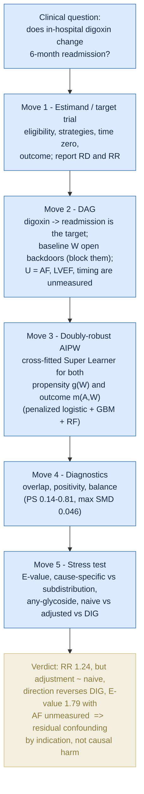

# Understanding the causal approach

A plain-language walkthrough of how the causal-inference approach works in this project — the five moves that take us from a clinical question to a defensible answer, and why the answer here is a lesson about confounding rather than a claim about a drug.

## Move 1 — Define the estimand by emulating a target trial

Before touching the data, we write down the randomized trial we *wish* we could run, then emulate it observationally. Eligibility: patients hospitalized for heart failure. Two strategies: receive in-hospital digoxin vs. not. Assignment: not randomized, so we reconstruct it from admission-time information. Outcome: all-cause readmission within 6 months. The **estimand** is the contrast we report — the risk difference and risk ratio between the two strategies. Framing the question as a target trial forces every later choice (who is eligible, when "time zero" is, what counts as the treatment) to be explicit instead of implied. This step rests on **consistency / SUTVA**: a well-defined version of "digoxin" and no interference between patients.

## Move 2 — Draw the DAG to make the assumptions visible

A directed acyclic graph encodes what we believe causes what. The arrow of interest is digoxin -> readmission. Baseline characteristics W — the 14 admission-time confounders: age, sex (male), prior admissions, NYHA class, Killip grade, BNP, creatinine, eGFR, Charlson index, heart rate, SBP, DBP, potassium, and sodium — cause *both* who gets digoxin and who is readmitted — they open **backdoor paths** that we must block by adjustment. Crucially, the DAG also shows what we *cannot* block: unmeasured causes U — above all **atrial fibrillation**, plus LVEF and medication timing — that are absent from the data. AF is the textbook case: it is a primary reason to prescribe digoxin and an independent driver of readmission, so it sits on an open backdoor we can only reason about, not close. The DAG is what tells us, in advance, that an E-value will be the load-bearing sensitivity analysis.

## Move 3 — Estimate with a doubly-robust method and an ML ensemble

We estimate the effect with **AIPW** (augmented inverse-probability weighting), which combines two models: a **propensity model** g(W) for who received digoxin, and an **outcome model** m(A,W) for who was readmitted. AIPW is **doubly robust** — it stays consistent if *either* model is correct. We do not hand-specify either; each is a **cross-fitted Super Learner** stacking penalized logistic regression, gradient boosting, and random forests, so flexible relationships are captured without overfitting the same rows we estimate on. Confidence intervals come from the **efficient influence function**, so they are valid regardless of the ML internals. This is the engine; Moves 4 and 5 are what make its output trustworthy.

## Move 4 — Run diagnostics to check the assumptions hold in the data

A doubly-robust estimate is only as good as **overlap** and **positivity**: every kind of patient must have been able to go either way. We check the propensity-score histograms by arm (they overlap), the score range (0.14-0.81, with 0% outside [0.05, 0.95], so no trimming is needed), and covariate **balance** before vs. after weighting (the love plot: maximum standardized difference falls to 0.046, well under 0.10). These diagnostics confirm the *measured* part of the problem is handled cleanly — which sharpens, rather than softens, the conclusion that what remains is unmeasured.

## Move 5 — Stress-test the result before believing it

Finally we try to break the finding. The **E-value** asks how strong an unmeasured confounder would have to be to erase the effect (1.79 for the point estimate, 1.45 for the CI bound — modest, and well within reach of AF). The **cause-specific vs. subdistribution** views are compared (they agree, as expected for a mortality-neutral drug). The exposure is widened to **any cardiac glycoside** (same picture). And **naive vs. adjusted vs. the DIG randomized trial** are placed side by side in a forest plot, so a reader sees the confounding with their own eyes.

## Verdict and contribution

The adjusted estimate is RR 1.24 (95% CI 1.11-1.40) — digoxin *appears* to raise readmission. But three things converge: adjustment barely moves the estimate (naive 1.26 -> 1.24), the direction reverses the DIG trial (which reduced HF hospitalization), and the E-value is small while AF is unmeasured. The honest verdict is **residual confounding by indication**, not causal harm. The **contribution** is methodological: the first target-trial / treatment-effect analysis on this dataset (its published literature is predictive ML only), executed transparently end to end — pre-registered protocol, explicit DAG, doubly-robust estimation, and pre-specified sensitivity analyses that are reported exactly as they fell.

## The reasoning as a diagram

